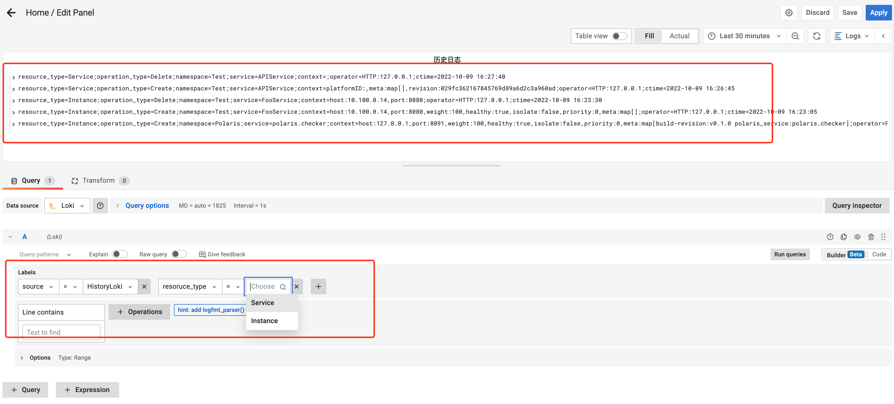

# 历史操作记录日志上报Loki插件

[author: alexwanglei](https://github.com/alexwanglei)

[English](./README.md) | 中文

插件实现将历史操作记录日志发送到Loki日志系统，通过Grafana对Loki中的日志进行检索和可视化展示。

## 一、准备工作
### 安装部署loki

下载二进制包
```
$ curl -O -L "https://github.com/grafana/loki/releases/download/v2.6.1/loki-linux-amd64.zip"
# extract the binary
$ unzip "loki-linux-amd64.zip"
# make sure it is executable
$ chmod a+x "loki-linux-amd64"
```
下载配置文件
```
$ wget https://raw.githubusercontent.com/grafana/loki/v2.6.0/cmd/loki/loki-local-config.yaml
```
启动Loki
```
$ nohup ./loki-linux-amd64 -config.file=loki-local-config.yaml > ./loki.log 2>&1 &
```
更多安装方式请参考 [Loki官方安装文档](https://grafana.com/docs/loki/latest/installation/)

### 安装部署Grafana
RPM包安装
```
$ wget https://dl.grafana.com/enterprise/release/grafana-enterprise-9.1.6-1.x86_64.rpm
$ sudo yum install grafana-enterprise-9.1.6-1.x86_64.rpm
```
启动Grafana服务
```
$ sudo systemctl daemon-reload
$ sudo systemctl start grafana-server
$ sudo systemctl status grafana-server
```
更多安装方式请参考 [Grafana官方安装文档](https://grafana.com/docs/grafana/latest/setup-grafana/installation/)

## 二、插件配置与使用

### 编译插件

1. git clone https://github.com/polarismesh/polaris.git
2. 进入 polaris 目录
3. 执行 **go get github.com/polaris-contrib/polaris-server-plugin-history-loki**
4. 执行 **go mod tidy -compat=1.17**
5. 编辑 polaris/plugin.go, 在 import 块中添加   
   ```go
   import (
        ...
	    _ "github.com/polarismesh/polaris/plugin/history/loki" # 引入插件，并触发插件的自动注册逻辑
   )
   ```
5. 执行 build.sh 构建 polaris-server

### 在 polaris-server 启用

在 polaris-server.yaml 配置文件中，插件配置部分，history插件配置块设置如下配置：

```YAML
plugin:
  history:
    name: HistoryLoki                                    # [必填]插件名称
    option:
      queueSize: 1024                                    # [必填]日志缓存队列长度
      pushURL: http://127.0.0.1:3100/loki/api/v1/push    # [必填]loki push 接口地址
      tenantID: "test"                                   # [可选]设置loki日志租户
      labels:                                            # [可选]自定义日志标签
        key1: "value1"
        key2: "value2"
      timeout: 5s                                        # [可选]发送日志http请求超时时间，默认10s
```
polaris-server启动后，会根据配置文件加载插件，历史操作记录会通过插件上报到Loki日志系统。

## 三、Grafana查询Loki日志

### Grafana配置Loki数据源
在Grafana页面中点击配置图标，点击数据源，添加Loki数据源：
- Name: 设置数据源名字
- URL: 设置Loki实例的地址


配置完成后在页面底部点击`保存&测试`按钮，如果Loki系统正在运行，并且有日志上报到系统，会提示数据源已连接并发现标签。


### 查询Loki日志
创建一个Grafana面板用来展示日志，数据源选择Loki，根据标签进行日志筛选生成查询条件，插件默认会设置`source`、`resource_type`和`operation_type`三个标签，`source`取值为插件名称`HistoryLoki`，`resource_type`为操作记录中的资源类型，`operation_type`为操作记录中的操作类型。



更多配置和使用请参考 [在Grafana中使用Loki](https://grafana.com/docs/grafana/latest/datasources/loki/)

